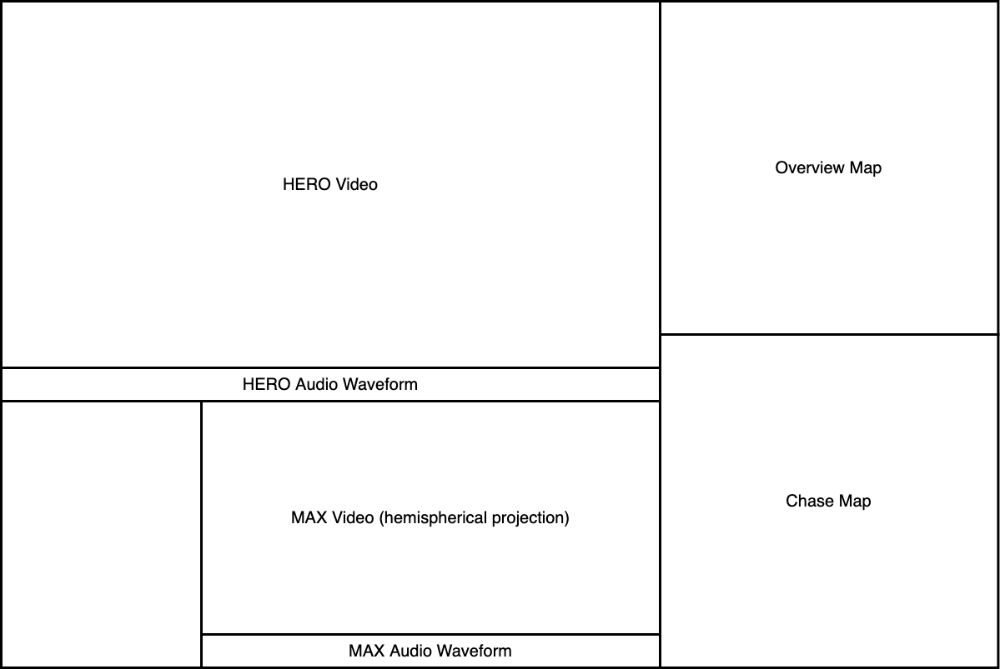

# Video Compositor

Collection of tools implementing a pipeline for compositing videos and data extracted from audio and location stream channels. This implement a combined view of visual, audio and GPS location information in a single video output.

## Why composite the data?

These videos are review files from training sessions which means they tend to be rendered and then archived for review at a later date. Rather than building out software to do the composition of channels from extracted metadata at playback time, it's arguably easier to compose the videos once completely, then use any off the shelf video player for review without any other software dependencies.

What Does 

## What's the goal

The goal is to produce a composited output video with a layout like the following:

## Source Data

Source data from training sessions are in the form of video output from two GoPro cameras:

1. GoPro Hero 5 action camera

2. GoPro Max 360 action camera

### GoPro Hero 5

This camera is configured

## concat_mp4

Simple tool to drive ffmpeg to concat mp4 files.

## gen_wave_plot.py

Tool to generate a waveform image of a media files audio.

## gen_waveform_slider.py

Tool to generate a video file based on a supplied background image with progress line based on total time.
Intended to provide positional progress indication across a background image (like a waveform plot).

## video_geometry.py

Tool to get the geometry parameters of a video file. Probably redundant.

## Dependencies

* ffmpeg
* python3
* openmpas_tiler
