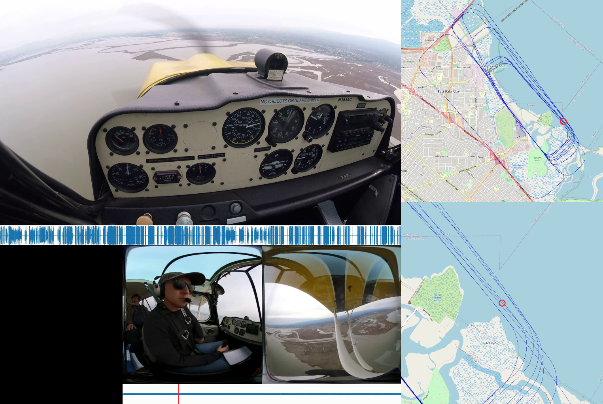
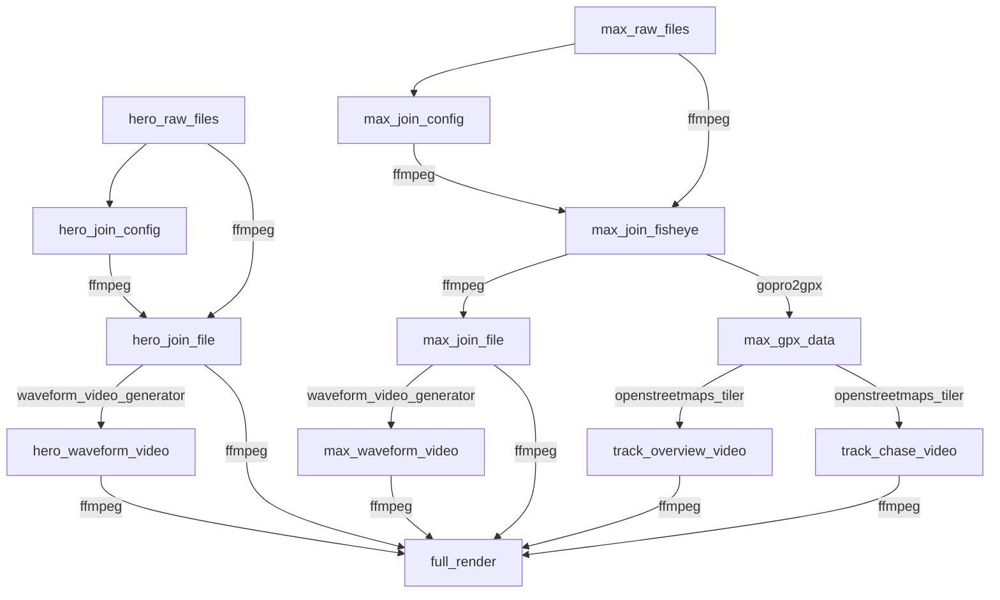

# Video Compositor

This project is largely a makefile for driving a number of other tools to implementing a pipeline for compositing videos and data extracted from audio and location stream channels. This implement a combined view of visual, audio and GPS location information in a single video output to allow for multiple views of the same video sequence (and associated data) to be rendered together.

## What's the goal

The goal is to take video from two GoPro cameras and combine them. One of the cameras is a 360 camera (GoPro Max) which also saves GPS location during the recording. The other camera is a standard action camera (GoPro Hero5). The output renders the following:

* Hero video stream

* Hero audio waveform - represented as a 2-dimensional waveform (with time marker)

* Max video stream remapped to hemispherical projection

* Max audio waveform - represented as a 2-dimensional waveform (with time marker)

* Overview map - representation of the GPS data indicating current position as well as overall track (complete track is always visible)

* Chase map - representation of the GPS data zoomed in (to show nearby map features) with current position in the center

Time synchronization of the two video is done by configuration data to allow for video, audio and map data to be synchronized.

The output layout shown in this diagram:


And example from real data:



### Why composite the data?

These videos are review files from training sessions which means they tend to be rendered and then archived for review at a later date. Rather than building out software to do the composition of channels from extracted metadata at playback time, it's arguably easier to compose the videos once completely, then use any off the shelf video player for review without any other software dependencies.

## Source Data

Source data from training sessions are in the form of video output from two GoPro cameras:

1. GoPro Hero 5 action camera

2. GoPro Max 360 action camera

### GoPro Hero 5

This camera is configured as a standard action camera capturing forward action. This camera has its own audio stream which needs to be mixed into the final output (at a given volume)

### GoPro Max 360

This camera is a 360 camera which captures raw video in dual fisheye output (I'm using the LRV low resolution output files). This video stream needs to be mapped to hemispherical projection (basically fisheye, but skewed out to a rectangular representation). This camera also has its own audio stream that needs to be mixed into the final output

## Dependencies

This project is mostly a build script and most of the work is done in dependent tools, some of which are custom tools implementing the pipeline. Others are open source.

### Custom tools

There are two custom tools required for running this pipeline:

* [**openstreetmaps_tiler**](https://github.com/stakita/openstreetmaps_tiler)
  
  * Used to transform a [GPX](https://en.wikipedia.org/wiki/GPS_Exchange_Format) file into map videos based on the location and temporal information
  
  * Uses https://www.openstreetmap.org/ tiles
  
  * This tool is responsible for the chase and overview map representations

* [**waveform_video_generator**](https://github.com/stakita/waveform_video_generator)
  
  * Used to transform an audio stream (possibly embedded in a video file) and generate a 2-dimensional waveform representation with timing marker for current progress relative to the waveform

### Other dependencies

- [**ffmpeg**](https://ffmpeg.org/)
  - Most of the video transformations are done with ffmpeg
  - Insanely complicated and insanely powerful
- [**gopro2gpx**](https://github.com/juanmcasillas/gopro2gpx)
  - Used to extract GPX telemetry data from GoPro video files
- [**jq**](https://stedolan.github.io/jq/)
  - Getting output from ffmpeg can be challenging, but it supports json output, so jq is our friend
- python3
  - For lots of little things in the build pipeline

## Build process

The build process starts with the raw camera files and implements the following dependency tree:



## Usage

The makefile is intended to be symbolic linked into a target directory where the raw videos are stored. The build expects the following filesystem hierarchy for processing the files:

```
.
├── Makefile -> [...path-to-repository...]/Makefile (symbolic link)
├── hero5
│   ├── GOPR0000.LRV
│   ├── GOPR0000.MP4
│   ├── GOPR1000.LRV
│   ├── GOPR1000.MP4
│   └── ...
└── max
    ├── GS010082.360
    ├── GS010082.LRV
    ├── GS020082.360
    ├── GS020082.LRV
    └── ...
```

Once the `Makefile` symbolic link is in place, make can be invoked like so:

```
# build target for the full merged map render
make merged_map
```

Other convenience targets that exist:

* `config` - generate the config file for adding in synchronization offsets prior to the full build

* `merged` - build a side by side render without the maps view

* `merged_map` - build the full render (both videos, waveforms, and map views)

* `clean` - clean out generated files except the initial join files (combined raw file for each camera)

* `distclean` - clean out generated files leaving just the final artifact videos and configuration used

* `clobber` - clean everything
